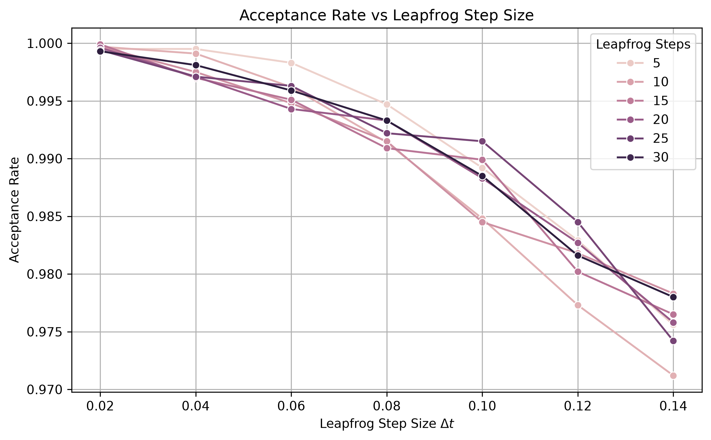
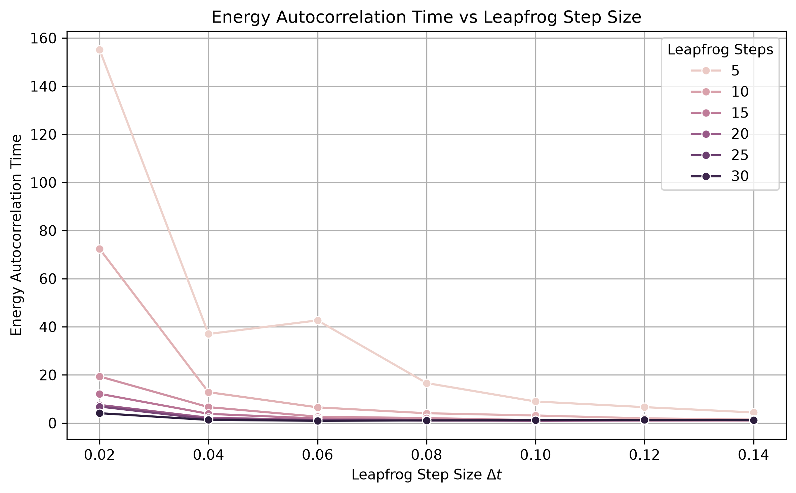
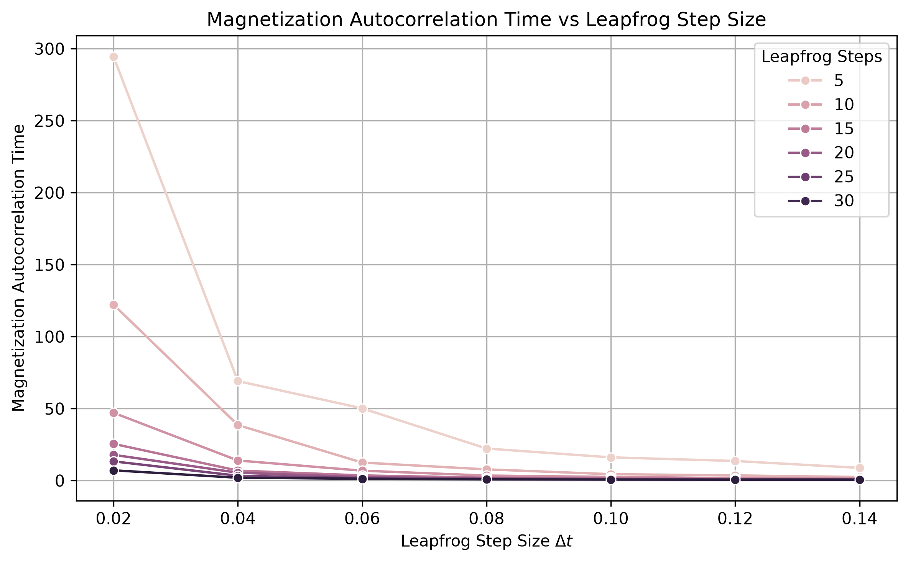
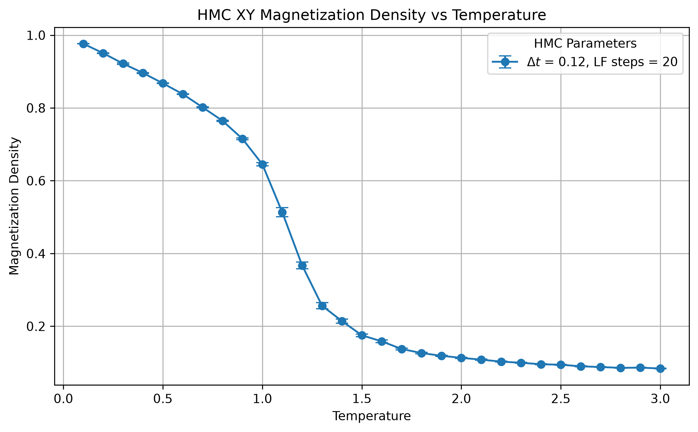
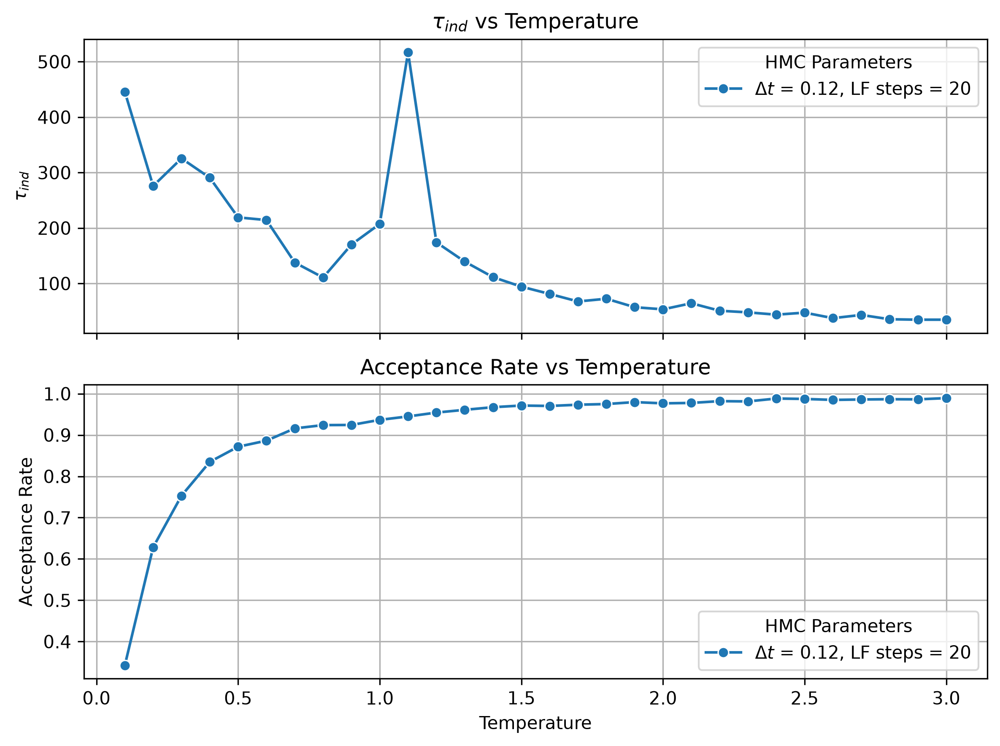

# Monte Carlo Ising Model

C++ implementation of the 2D Ising and classical XY models using Metropolis, Wolff cluster and Hybrid Monte Carlo (HMC) algorithms, with statistical error analysis and a Python plotting workflow for the resulting data. The repository currently includes:

- a reusable lattice geometry layer,
- the 2D Ising model,
- Metropolis single-spin updates,
- Wolff single-cluster updates,
- error-analysis utilities,
- data-export helpers,
- Python plotting scripts,
- and a Hybrid Monte Carlo implementation for the 2D XY model.

## Overview

This project simulates 2D lattice spin systems to study ordering behavior, phase-transition physics, Monte Carlo sampling efficiency and statistical error estimation. It implements local, cluster, and Hamiltonian Monte Carlo approaches. Metropolis and Wolff updates are compared for the 2D Ising model, while HMC extends the repository to the continuous-spin 2D XY model.

- **Metropolis single-spin-flip** — the baseline local-update algorithm.
- **Wolff cluster algorithm** — a non-local cluster update that greatly reduces critical slowing down near the critical temperature.
- **Hybrid Monte Carlo (HMC)** for the classical XY model — a molecular-dynamics-based sampler (leapfrog integration + Metropolis accept/reject) for continuous spin angles, as opposed to the discrete ±1 spins of the Ising model.

Each simulation driver measures energy and magnetization statistics, estimates autocorrelation times and exports results as CSV/`.dat` files that the Python scripts turn into plots.

## Features

- 2D periodic square lattice construction
- Cold and hot spin initialization for the Ising model
- Total-energy and total-magnetization calculations
- Metropolis sampling for the Ising model
- Wolff cluster sampling for the Ising model
- Autocorrelation-time and standard-error utilities
- Export of chain data and summary tables
- Hybrid Monte Carlo for the 2D XY model
- HMC parameter scans over leapfrog step size and leapfrog step count
- HMC temperature scans with acceptance-rate and autocorrelation diagnostics
- Python plotting workflows for all major outputs

## Repository layout

```text
├── include/              # Public headers for the core library
├── src/                  # Implementation of the core library
├── tests/                # Simulation drivers and validation executables
├── scripts/              # Python plotting scripts
├── plots/                # Generated example plots
├── CMakeLists.txt        # C++ build configuration
├── requirements.txt      # Python plotting dependencies
├── LICENSE               # MIT license
└── README.md             # Project documentation
```
Despite the name, the files in `tests/` are simulation drivers with interactive command-line prompts (not unit tests) — each one runs a specific study and writes its results to a `results/` directory.

| File | Description |
|---|---|
| `test_lattice.cpp` | Sanity check for lattice construction and neighbour tables |
| `test_ising_model.cpp` | Sanity check for spin initialization and energy/magnetization calculation |
| `test_metropolis.cpp` | Runs a Metropolis Markov chain at a fixed temperature |
| `test_temperature_scan.cpp` | Metropolis temperature scan across the phase transition |
| `test_wolff_cluster.cpp` | Wolff cluster temperature/phase scan |
| `test_metropolis_wolff_comparison.cpp` | Runs both algorithms under matched conditions for direct comparison |
| `test_error_analysis.cpp` | Compares autocorrelation, blocking and bootstrap error estimators |
| `test_hmc_xy_temperature_scan.cpp` | HMC temperature scan for the classical XY model |
| `test_hmc_xy_parameter_scan.cpp` | Scans leapfrog step size/count to study HMC acceptance rate and efficiency |

## Core library

The reusable simulation code lives in `include/` and `src/` and is built as a static library, `ising_model_core`:

- `lattice` — square lattice with periodic boundary conditions
- `ising_model` — discrete-spin (±1) Ising model built on `Lattice`
- `hmc_xy_model` — continuous-spin XY model with leapfrog integration, built on `Lattice`
- `metropolis` — single-spin-flip Metropolis sweeps
- `wolff_cluster` — Wolff cluster sweeps
- `measurements` — specific heat and magnetic susceptibility from energy/magnetization variance
- `statistics` — mean, variance and power-law fitting
- `error_analysis` — autocorrelation time, blocking method and bootstrap error estimation
- `data_export` — CSV/`.dat` export helpers

## Recommended parameter settings

These are practical starting points for this repository, not hard-coded defaults.

| Workflow | Algorithm | Lattice size | Equilibration | Measurement length | Temperature grid | Algorithm parameters |
|---|---|---:|---:|---:|---|---|
| Ising Metropolis temperature scan | Metropolis single-spin updates | 64 | optional / discarded by filter | `100000` sweeps | project scan range | lookup-table Metropolis updates |
| Ising Metropolis vs Wolff comparison | Metropolis + Wolff cluster | 64 | optional / discarded by filter | `100000` sweeps / cluster flips | phase-region scan | Metropolis sweeps and Wolff single-cluster updates |
| Coarse HMC parameter scan | HMC for XY model | 16 | none explicit in parameter-scan driver | 500–1000 trajectories per point | fixed `T` near region of interest | repo default leapfrog grid |
| Final HMC parameter scan | HMC for XY model | 16 | none explicit in parameter-scan driver | 3000–5000 trajectories per point | fixed `T` | repo default grid, then refine |
| Coarse HMC temperature scan | HMC for XY model | 16 | 500–1000 trajectories | 2000–3000 trajectories | `0.1, 0.2, ..., 3.0` | best point from parameter scan |
| Final HMC temperature scan | HMC for XY model | 16 | 1000–3000 trajectories | 5000–10000 trajectories | `0.1, 0.2, ..., 3.0` | best point from parameter scan |

### Repository parameter-scan grid

| Quantity | Values |
|---|---|
| Leapfrog step size `Δt` | `0.02, 0.04, 0.06, 0.08, 0.10, 0.12, 0.14` |
| Leapfrog steps | `4, 8, 12, 16, 20, 24, 32` |

## Running a simulation

### Requirements

**C++ build**
- CMake ≥ 3.16
- A C++17 compiler
- OpenMP (optional, used automatically if found)
- GSL (optional, used automatically if found)

**Python plotting**
- Python 3
- `pandas`, `numpy`, `scipy`, `matplotlib`, `seaborn`

### Building

```bash
git clone https://github.com/LittleBigPluton/Monte-Carlo-Ising-Model.git
cd Monte-Carlo-Ising-Model
cmake -S . -B build -DCMAKE_BUILD_TYPE=Release
cmake --build build
```

#### Environment
#### Python environment

Creating a virtual environment is optional, but recommended for isolating the plotting dependencies from the system Python installation.

```bash
python3 -m venv venv
source venv/bin/activate
pip install -r requirements.txt
```

Then the plotting scripts can be run from the repository root by python command, for example:
```bash
python3 scripts/plot_xx.py
```

###  Example Usage

#### Run the HMC XY temperature scan

```bash
./build/test_hmc_xy_temperature_scan
```

You will be prompted for:

- lattice size
- number of equilibration trajectories
- number of measurement trajectories
- leapfrog step size
- number of leapfrog steps

This executable scans temperatures from `0.1` to `3.0` in given leapfrog step size.

### Run the HMC XY parameter scan

A parameter-scan driver exists at

- `tests/test_hmc_xy_parameter_scan.cpp`

and the intended workflow is:

```bash
./build/test_hmc_xy_parameter_scan
```

That workflow asks for:

- lattice size
- number of HMC trajectories
- fixed scan temperature

and then scans the built-in leapfrog grid.

### Generate plots

After producing the corresponding CSV files:

```bash
python3 scripts/plot_hmc_xy_temperature_scan.py
python3 scripts/plot_hmc_xy_parameter_scan.py
```

Plots are saved under:

- `plots/hmc_xy/temperature_scan/`
- `plots/hmc_xy/parameter_scan/`

## Output files

### HMC XY temperature scan

Main summary CSV:

```text
results/hmc_xy/summary/hmc_xy_temperature_scan.csv
```

Per-temperature chain exports:

```text
results/hmc_xy/chains/energies_<k>.dat
results/hmc_xy/chains/magnetizations_<k>.dat
```

### HMC XY parameter scan

Main summary CSV:

```text
results/hmc_xy/summary/hmc_xy_parameter_scan.csv
```

### Legacy Ising workflows

Examples of runtime-generated output directories:

```text
results/summary/
results/chains/
results/autocorrelation/
results/comparison/
```

## Output format and interpretation

### Temperature-scan CSV columns

| Column | Meaning |
|---|---|
| `Temperature` | physical temperature used for the run |
| `LeapfrogStepSize` | HMC leapfrog step size `Δt` |
| `LeapfrogSteps` | number of leapfrog steps per trajectory |
| `AcceptanceRate` | accepted trajectories divided by total trajectories |
| `EnergyDensity` | average energy density over measurement trajectories |
| `MagnetizationDensity` | average magnetization density over measurement trajectories |
| `MagnetizationSE` | autocorrelation-corrected standard error of magnetization density |
| `EnergyTau` | integrated autocorrelation time for energy density |
| `MagnetizationTau` | integrated autocorrelation time for magnetization density |

### Parameter-scan CSV columns

| Column | Meaning |
|---|---|
| `Temperature` | fixed scan temperature |
| `LeapfrogStepSize` | HMC leapfrog step size `Δt` |
| `LeapfrogSteps` | number of leapfrog steps |
| `AcceptanceRate` | accepted trajectories divided by total trajectories |
| `EnergyTau` | integrated autocorrelation time for energy density |
| `MagnetizationTau` | integrated autocorrelation time for magnetization density |
| `IndependentTimeEnergy` | cost proxy based on energy autocorrelation and leapfrog count |
| `IndependentTimeMagnetization` | cost proxy based on magnetization autocorrelation and leapfrog count |
| `MagnetizationDensity` | mean magnetization density |
| `MagnetizationSE` | autocorrelation-corrected standard error |

### Practical interpretation

- **High `AcceptanceRate`** usually indicates stable HMC integration.
- **Low `EnergyTau` / `MagnetizationTau`** indicates faster decorrelation.
- **Low `IndependentTime...`** usually indicates better efficiency per independent sample.
- **`MagnetizationDensity` with `MagnetizationSE`** is the main temperature-scan observable for order/disorder trends.

## Sample CSV schema snippets

The repository does not currently track sample `results/` CSV files, so the tables below are illustrative schema examples.

### Example temperature-scan row

| Temperature | LeapfrogStepSize | LeapfrogSteps | AcceptanceRate | EnergyDensity | MagnetizationDensity | MagnetizationSE | EnergyTau | MagnetizationTau |
|---:|---:|---:|---:|---:|---:|---:|---:|---:|
| `1.0` | `0.06` | `16` | `<float>` | `<float>` | `<float>` | `<float>` | `<float>` | `<float>` |

### Example parameter-scan row

| Temperature | LeapfrogStepSize | LeapfrogSteps | AcceptanceRate | EnergyTau | MagnetizationTau | IndependentTimeEnergy | IndependentTimeMagnetization | MagnetizationDensity | MagnetizationSE |
|---:|---:|---:|---:|---:|---:|---:|---:|---:|---:|
| `1.0` | `0.06` | `16` | `<float>` | `<float>` | `<float>` | `<float>` | `<float>` | `<float>` | `<float>` |

## Plotting

### HMC XY parameter-scan plots

The repository already contains generated figures such as:

- `hmc_xy_parameter_scan_AcceptanceRate.png`
- `hmc_xy_parameter_scan_EnergyTau.png`
- `hmc_xy_parameter_scan_IndependentTimeEnergy.png`
- `hmc_xy_parameter_scan_IndependentTimeMagnetization.png`
- `hmc_xy_parameter_scan_MagnetizationDensity.png`
- `hmc_xy_parameter_scan_MagnetizationTau.png`

### HMC XY temperature-scan plots

The repository already contains generated figures such as:

- `hmc_xy_magnetization_density_temperature_scan.png`
- `hmc_xy_temperature_scan_EnergyDensity.png`
- `hmc_xy_temperature_scan_EnergyTau.png`
- `hmc_xy_temperature_scan_IndependentTimeMagnetization.png`
- `hmc_xy_temperature_scan_MagnetizationTau.png`
- `hmc_xy_temperature_scan_diagnostics.png`

### Example figures for HMC XY

#### Acceptance rate vs leapfrog step size



#### Energy autocorrelation time vs leapfrog step size



#### Magnetization autocorrelation time vs leapfrog step size



#### Magnetization density vs temperature



#### Independent-time diagnostic and acceptance rate vs temperature



## Topics and keywords

| Core topics | Good additional topics |
|---|---|
| `ising-model` | `lattice-simulation` |
| `metropolis-algorithm` | `statistical-mechanics` |
| `wolff-cluster` | `numerical-physics` |
| `hybrid-monte-carlo` | `computational-statistical-physics` |
| `xy-model` | `finite-size-scaling` |
| `autocorrelation` | `monte-carlo-simulation` |

## License

This project is released under the MIT License. See the `LICENSE` file for details.
